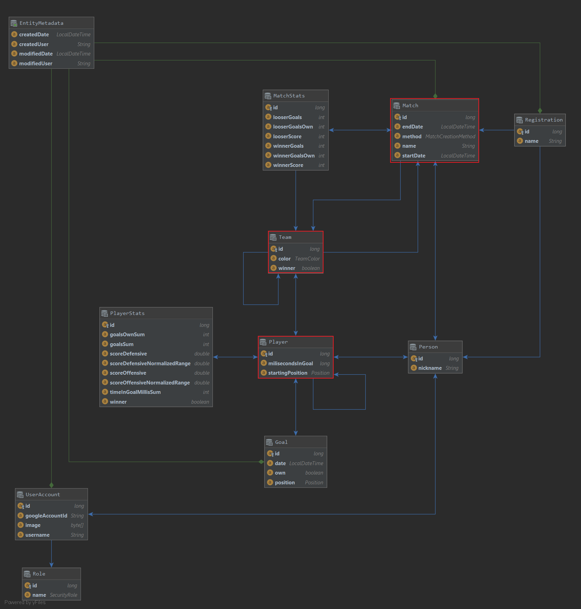

[](https://travis-ci.org/jurajcik/wuzeln) [](https://codecov.io/gh/jurajcik/wuzeln)


# Wuzeln Manager

## Building with Maven
Build the whole project also with installing npm and building the angular frontend. 
By default uses the configuration for the local DB. 
You must specify path to your external configuration with the property `externConfigRoot`.
```
mvn clean package -DexternConfigRoot=path/to/configuration
```
There are several option that can be combined during development:
- skip building angular frontend: `-DskipFrontend`
- skip tests: `-DskipTests`
- build with embedded in-memory H2 DB: `-P h2`
- run on local jetty: `appengine:devserver`

 Build and deploy to google cloud:
```
mvn clean appengine:update -P gcp -DexternConfigRoot=path/to/configuration
``` 

## Domain Model



