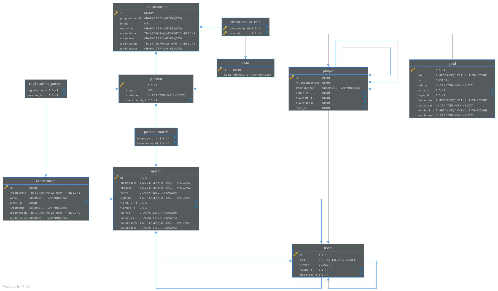

# Wuzeln Manager

## Building with Maven
Build the whole project also with installing npm and building the angular frontend. 
By default uses the configuration for the local DB. 
You must specify path to your external configuration in the property `externConfigRoot`.
```
mvn clean package -DexternConfigRoot=path/to/configuration
```

Build only the backend without tests (with local DB):
```
mvn clean package -DskipFrontend -DskipTests
``` 

Build and run local jetty (with local DB):
``` 
mvn clean appengine:devserver -P localhost
``` 

Build and deploy to google cloud:
```
mvn clean appengine:update -P gcp
``` 

Build with embedded in-memory H2 DB: 
```
mvn clean package -P h2
```

## Domain Model


## ER Diagram

